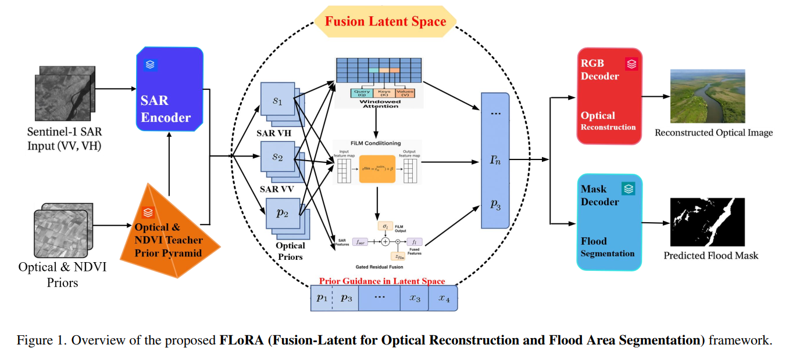
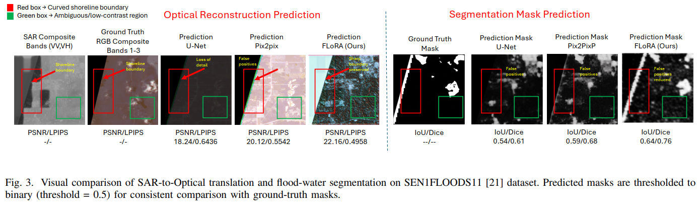

# FLoRA
FLoRA: Fusion-Latent for Optical Reconstruction &amp; Area Segmentation is a multi-task deep learning architecture designed for multi-modal SAR–Optical data fusion in flood mapping and environmental monitoring.

The code is built on [Pix2pix (PyTorch)](https://github.com/phillipi/pix2pix) (PyTorch) and tested on Ubuntu 20.04.6 environment (Python 3.10.13, PyTorch >= 1.1.0) with NVIDIA RTX A4000 with 16GB RAM. 
## Contents
1. [Introduction](#introduction)
2. [Key Highlights](#keyhighlights)
3. [Dependencies](#dependencies)
4. [Train](#train)
5. [Test](#test)
6. [Results](#results)
7. [Acknowledgements](#acknowledgements)

## Introduction

This repository provides the official implementation of FLoRA — Fusion-Latent Optical Reconstruction & Area Segmentation — a unified cross-modal framework for flood mapping that jointly performs SAR-to-Optical translation and flood-region segmentation.

Instead of treating translation and segmentation as isolated tasks, FLoRA builds a single multi-task pipeline where Sentinel-1 VV/VH features are aligned with optical priors through a fusion-latent space. A lightweight optical teacher network guides SAR feature learning using RGB and NDVI cues, while multi-scale windowed cross-attention and FiLM conditioning enforce spectral fidelity, structural consistency, and hydrologic realism.

Designed for disaster response workflows, FLoRA stabilizes joint optimization through gradient decoupling and uses a GAN-enhanced reconstruction objective (Charbonnier + SSIM + FFT) combined with Dice/BCE segmentation losses. Trained on SEN1Floods11, SEN12MS, and DeepFlood, the model produces perceptually accurate optical reconstructions and reliable flood-extent predictions—even under heavy noise and clutter typical of SAR imagery.





## Key Highlights:

 * Unified Multi-Task Pipeline: Performs SAR-to-Optical translation and flood-region segmentation within a single framework, eliminating the need for separate models and reducing error propagation.

 * Fusion-Latent Representation: Learns a shared latent space where SAR features are dynamically aligned with optical priors using multi-scale windowed cross-attention and FiLM-based conditioning.
   
 * Optical-Teacher Distillation: A lightweight teacher network driven by RGB and NDVI cues supervises the SAR encoder, improving structural consistency, spectral realism, and hydrologic fidelity.

 * Hydrology-Aware Loss Design: Combines Charbonnier, SSIM, and FFT reconstruction losses with Dice/BCE segmentation penalties and boundary alignment—balancing perceptual quality with accurate flood delineation.

 * Gradient-Decoupled Optimization: Stabilizes joint learning across translation and segmentation tasks, preventing SAR noise from contaminating optical reconstruction and mask prediction.

 * Robust Cross-Modal Fusion: Effectively integrates multimodal information from Sentinel-1 (VV/VH) and Sentinel-2 (RGB/NDVI), improving generalization across diverse flood events, terrains, and seasons.
   
 * State-of-the-Art Performance: Achieves superior optical reconstruction and segmentation accuracy on SEN1Floods11, SEN12MS, and DeepFlood datasets, producing sharper textures, cleaner water boundaries, and higher PSNR/SSIM/IoU

## Dependencies
* Python 3.1
* PyTorch >= 1.1.0
* CUDA 12.2
* numpy
* skimage
* **imageio**
* matplotlib
* tqdm
* cv2 >= 3.xx (Only if you want to use video input/output)

## Train
### Prepare training data 

1. Download DEEPFLOOD Dataset, which includes co-registered Sentinel-1 SAR (VV, VH) and Sentinel-2 optical imagery, along with UAV references and auxiliary layers (NDWI, slope, DTM, flood masks). from [DEEPFLOOD dataset](https://figshare.com/articles/dataset/DEEPFLOOD_DATASET_High-Resolution_Dataset_for_Accurate_Flood_Mappingand_Segmentation/28328339).

2. Download SEN1FLOODS11 Dataset, from [SEN1FLOODS11 dataset](https://github.com/cloudtostreet/Sen1Floods11)

3. Download SEN12MS Dataset, from [SEN12MS dataset](https://mediatum.ub.tum.de/1474000)

4. Use SAR_VH, SAR_VV  as input and Optical as priors

5. Create train, test and validation sets 80%, 10% & 10%

6. Specify '--dir_data' based on the image's path. 


### Begin to train

Cd to 'src', run the following script to train models.

 **Use the train.py file in the src folder to begin training of the model**

    ```bash
    # Example Training
    python Flora/train.py 
    ```
## Test
### Quick start
1. Download DEEPFLOOD DATASET from [GEMS Lab](https://figshare.com/articles/dataset/DEEPFLOOD_DATASET_High-Resolution_Dataset_for_Accurate_Flood_Mappingand_Segmentation/28328339) and split the dataset into 80% train, 10% validation, & 10% test set.
2. Download SEN1FLOODS11 Dataset, from [SEN1FLOODS11 dataset](https://github.com/cloudtostreet/Sen1Floods11)
3. Download SEN12MS Dataset, from [SEN12MS dataset](https://mediatum.ub.tum.de/1474000)


Cd to 'src', run the following scripts.

 **Use the validation.py file in the src folder to begin training of the model**
 **Use the test.py file in the src folder to begin training of the model**

    ```bash
    
    # Example for Validation set
    python FLoRA/validation.py  
    ```
    ```bash
    
    # Example for Test set
    python FLoRA/test.py  
    ```


## Results
### Visual Patches




## Acknowledgements
This code is built on [Pix2pix (PyTorch)](https://github.com/phillipi/pix2pix) and [CycleGAN-PyTorch](https://junyanz.github.io/CycleGAN/). We thank the authors for sharing their codes.
